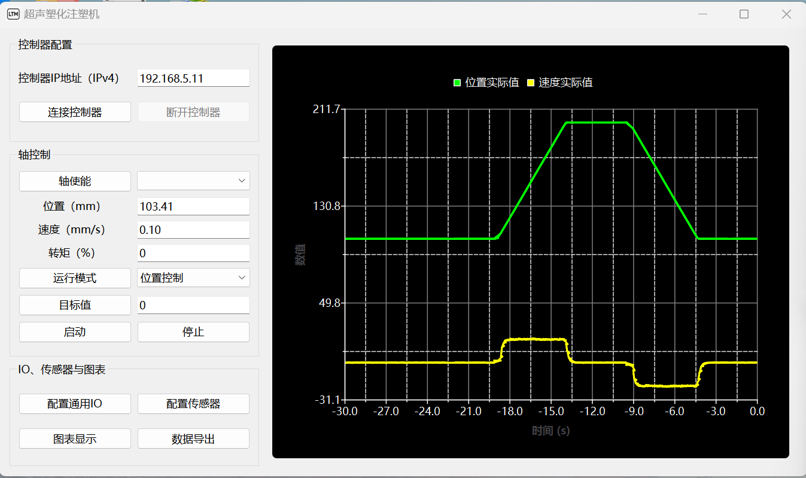
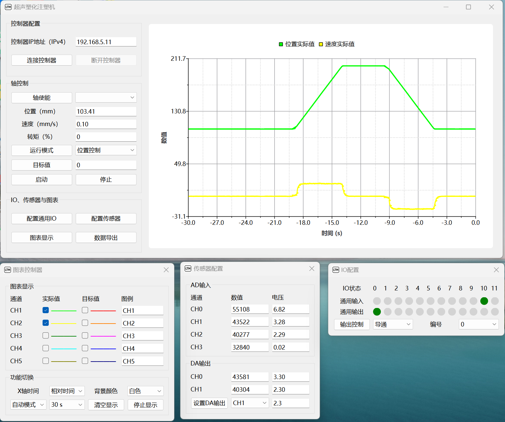

# UIM_Project – 超声塑化注塑机控制软件

基于 **Qt 6** 开发的超声塑化注塑机控制软件，提供实时曲线显示、运动控制、CSV数据导出等核心功能。

## 安装包

安装包 **UIM_Project_Installer.exe** 在 **bin** 文件夹下，双击即可启动安装。

## 软件界面

<div align="center">
    
    <p><em>主界面 - 控制器配置、轴控制、实时数据显示</em></p>
</div>

<div align="center">
    
    <p><em>图表设置对话框 - 传感器与IO口配置</em></p>
</div>


> 以上截图来自实际运行环境，界面可能因版本更新略有差异。

## 系统要求

- **操作系统**：Windows 10 / 11（64位）
- **编译器**：MinGW-w64（与 Qt 6 配套版本）
- **Qt 版本**：6.2 或更高（推荐 6.5.11）
- **CMake**：3.19 或更高
- **Python**：3.6 或更高（用于构建脚本）

---

## 依赖安装（详细步骤）

以下步骤确保你的环境能够**直接编译成功**。

### 1. 安装 Qt 6（MinGW 版本）
1. 从 [Qt 官网](https://www.qt.io/download) 下载在线安装器（或使用离线包）。
2. 安装时选择 **Qt 6.5.11**（或更高），并勾选以下组件：
   - `Qt 6.5.11` → `MinGW 64-bit`（包含 Qt Core, Widgets, Charts, Sql）
   - `Qt 6.5.11` → `Qt Charts`
   - `Qt 6.5.11` → `Qt Sql`（如需数据库支持）
   - `Developer and Designer Tools` → `MinGW 11.2.0`（或匹配的 MinGW 工具链）
3. 记录 Qt 安装路径（例如 `D:\Qt\6.5.11\mingw_64`），后续配置需要。

### 2. 安装 CMake
1. 访问 [CMake 官网](https://cmake.org/download/) 下载 Windows 安装包（`.msi` 或 `.exe`）。
2. 安装时勾选 **“Add CMake to the system PATH for all users”**。

### 3. 安装 Python 3
1. 从 [Python 官网](https://www.python.org/downloads/) 下载 Python 3.6 或更高版本安装包。
2. 安装时**务必勾选** “Add Python to PATH”。

### 4. 检查 MinGW 编译器路径
Qt 安装的 MinGW 位于 `D:\Qt\Tools\mingw1120_64\bin`（版本号可能不同）。  
确保该目录已添加至系统环境变量 `PATH` 中（通常 Qt 安装器会自动添加，可手动检查）。

### 5. 放置第三方动态库
本项目的 `motion` 模块依赖运动控制卡驱动 `LTSMC.dll`。请将该文件放入：
```
src/modules/motion/third_party/LTSMC/lib/LTSMC.dll
```
若缺少此文件，motion 模块无法编译或运行。请联系设备供应商获取该 DLL。

### 6. 验证环境
打开命令提示符，执行以下命令，确认各工具可用：
```bash
cmake --version      # 应显示 3.19 或更高
python --version     # 应显示 3.6 或更高
gcc --version        # 应显示 Qt 自带的 MinGW gcc 版本
```
如果 `gcc` 未找到，请检查 MinGW 路径是否在 PATH 中。

---

## 快速构建与安装

本项目提供了 Python 脚本 `script.py`，可以一键完成配置、编译、运行或安装。

### 1. 项目目录结构（关键部分）
```
UIM_Project/
├── src/
│   ├── modules/               # 动态库模块
│   │   ├── chart/
│   │   ├── motion/
│   │   └── ...
│   ├── ui_widgets/
│   │   ├── motion_ctrl_widget/
│   │   └── chart_dialog/
│   └── application/
│       └── UIM_APP/           # 主程序入口
├── CMakeLists.txt
├── script.py                  # 构建辅助脚本
└── README.md
```

### 2. 配置脚本（可选）
打开 `script.py`，可根据实际情况修改以下变量（通常无需改动）：
```python
PROJECT_NAME = "UIM_APP"                     # 可执行文件名
QT_PREFIX_PATH = "D:/Qt/6.5.11/mingw_64"     # Qt 安装路径
INSTALL_DIR = "D:/UIM_Project"               # 安装目录
BUILD_DIR = "build"                          # 临时构建目录
```

### 3. 使用脚本
在项目根目录打开命令提示符，执行：

| 命令 | 说明 |
|------|------|
| `python script.py -b` | 仅构建 Debug 版本（不运行） |
| `python script.py -D` | 构建并运行 Debug 版本（带控制台，方便调试） |
| `python script.py -R` | 构建并运行 Release 版本（无控制台） |
| `python script.py -i` | 构建并安装到 `INSTALL_DIR`（Release 版本，自动复制所有依赖） |
| `python script.py -c` | 清理构建目录 |

> **注意**：首次运行会自动进行 CMake 配置和编译，请确保网络通畅（如果 CMake 需要下载依赖）。

### 4. 手动构建（不使用 Python）
如果不希望使用 Python 脚本，可以手动执行 CMake 命令：

```bash
# 进入项目根目录
cd UIM_Project

# 创建并进入构建目录
mkdir build && cd build

# 配置（Release 版本）
cmake -G "MinGW Makefiles" -DCMAKE_PREFIX_PATH=D:/Qt/6.5.11/mingw_64 -DCMAKE_BUILD_TYPE=Release ..

# 编译
cmake --build .

# 安装到指定目录（可选）
cmake --install . --prefix D:/UIM_Project
```

安装后，需要手动将 Qt 运行时 DLL 和第三方 DLL 复制到安装目录的 `bin` 下（可参考 `script.py` 中的 `run_install` 函数）。

---

## 安装后的运行

安装完成后，在 `INSTALL_DIR/bin` 目录下会生成：
- `UIM_APP.exe` 主程序
- 所有依赖的动态库（`libchart.dll`, `libmotion.dll`, `libchart_dialog.dll` 等）
- Qt 运行库（`Qt6Core.dll`, `Qt6Charts.dll` 等）
- 平台插件（`platforms/qwindows.dll`）

直接双击 `UIM_APP.exe` 即可运行，无需额外配置环境变量。

---

## 常见问题

### 1. 编译时报“找不到 Qt6Charts”或“无法打开 Qt6::Charts”
- 检查 Qt 安装时是否勾选了 **Qt Charts** 模块。
- 确认 `CMAKE_PREFIX_PATH` 正确指向 Qt 的 MinGW 安装目录（例如 `D:/Qt/6.5.11/mingw_64`）。

### 2. 运行时提示“缺少 Qt6OpenGLWidgets.dll”或“LTSMC.dll”
- 使用 `python script.py -i` 安装时，脚本已自动复制所需 Qt DLL 和 `LTSMC.dll`。如果手动安装，请自行将这些文件放入 `bin` 目录。

### 3. 控制台窗口一闪而过
- 如果运行 `UIM_APP.exe` 时出现控制台窗口，说明当前是 Debug 版本或未设置 `WIN32` 子系统。请使用 `script.py -R` 构建 Release 版本。

### 4. 如何更换程序图标？
- 在 `src/application/UIM_APP/` 目录下放置 `app.ico`，并在该目录的 `CMakeLists.txt` 中添加资源文件（参考 Qt 文档）。

### 5. Python 脚本执行报错“cmake 不是内部或外部命令”
- 请确保 CMake 已安装并添加到系统 PATH 中，重启命令提示符。

---

## 项目结构说明

| 目录 | 内容 |
|------|------|
| `src/modules/chart`  | 图表动态库（提供实时曲线功能）   |
| `src/modules/motion` | 运动控制动态库（封装 LTSMC 驱动）|
| `src/ui_widgets/motion_ctrl_widget` | 运动控制 UI 控件 |
| `src/ui_widgets/chart_dialog` | 图表设置对话框 |
| `src/application/UIM_APP` | 主程序入口，链接上述模块 |
| `script.py` | 一键构建、运行、安装的辅助脚本 |

---

## 许可证

本项目基于 **GNU General Public License (GPL)** 开源，详细条款请见项目中的 `LICENSE` 文件。

